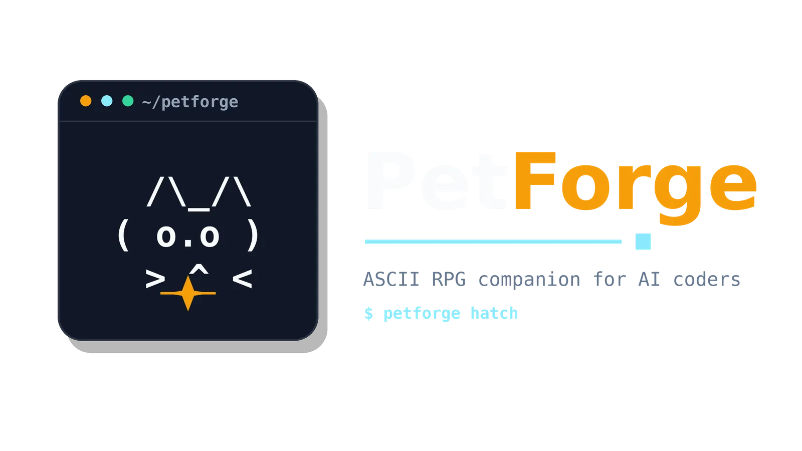

<p align="center">
  <picture>
    <source media="(prefers-color-scheme: dark)" srcset="./logos/petforge_logo_dark.webp">
    
  </picture>
</p>

<p align="center">
  <strong>Local-first RPG progression layer for AI coding companions.</strong><br>
  Tracks your real coding activity through Claude Code hooks, adds XP, levels, achievements, and terminal-native evolutions.
</p>

<p align="center">
  <a href="./CHANGELOG.md"></a>
  <a href="./LICENSE"></a>
  <a href="https://nodejs.org"></a>
</p>

---

## What

PetForge gives your terminal a deterministic ASCII pet that **levels up from real coding activity**. It listens to Claude Code's official hooks (`UserPromptSubmit`, `PostToolUse`, `Stop`, `SessionStart`, `SessionEnd`) and translates them into XP, evolutions across 6 phases, and 10 unlockable achievements.

If you have **Claude Buddy** enabled, PetForge silently uses Buddy's sprite as your pet's visual identity. If not, it generates an original PetForge creature locally. Either way, the progression layer is yours.

> **No Anthropic files are modified, copied, or redistributed.** PetForge ships its own pet engine and invokes Buddy at runtime only when the user has it enabled.

---

## Highlights

- 🥚 **6 evolution phases** — Egg → Hatchling → Junior → Adult → Elder → Mythic
- 🏆 **10 achievements** — Hatch (eclosion), Marathon, Night Owl, Streak 7d, Polyglot, Tool Whisperer, Centurion…
- 🐣 **5 deterministic species** — Pixel, Glitch, Daemon, Spark, Blob
- ✨ **5 rarities + shiny** — same odds inspired by classic RPGs
- 🪝 **5 official Claude Code hooks** — zero polling, instant updates
- 📺 **Live watch mode** — `petforge watch` refreshes XP and counters every 500ms while you code
- 📱 **Stream to your phone** — `petforge serve --lan` exposes a live web view via SSE
- 📊 **OTel integration** — opt-in via `petforge collect`, unlocks 8 new achievements based on lines/tokens/cost
- 🔒 **100% local** — zero telemetry, zero phone-home, zero account
- 🧰 **Cross-platform** — Windows, macOS, Linux

---

## Install

```bash
npm install -g @mindvisionstudio/petforge
```

Then configure Claude Code hooks (one-time, interactive):

```bash
petforge init
```

You're done. Use Claude Code normally and watch your pet evolve.

---

## Commands

| Command | What it does |
|---|---|
| `petforge` | Renders your pet snapshot (with idle animation if your terminal is interactive) |
| `petforge init` | Configures Claude Code hooks (with backup, idempotent) |
| `petforge card` | Full status card: pet, species, rarity, stats, level, XP bar, achievements |
| `petforge watch` | Live mode: continuous animation + auto-refresh of XP / level / counters every 500ms (Ctrl+C / q to exit) |
| `petforge buddy [on\|off\|auto]` | Toggle Claude Buddy visual integration |
| `petforge serve [--port=N] [--lan] [--token=XXX]` | HTTP server with mobile-friendly web view (live updates via SSE) |
| `petforge collect [--port=7879] [--forward=URL]` | OTLP/HTTP/JSON collector for Claude Code metrics (strict 127.0.0.1) |
| `petforge doctor` | Health check (hooks installed, state valid, Buddy detected, etc.) |

---

## How it works

```
┌─────────────────────────────────────────────────┐
│ Display      petforge / watch / card            │
└─────────────────────────────────────────────────┘
                       ↑ reads (live in watch mode)
┌─────────────────────────────────────────────────┐
│ State        ~/.petforge/state.json (locked)    │
└─────────────────────────────────────────────────┘
                       ↑ writes
┌─────────────────────────────────────────────────┐
│ Hooks        5 Claude Code events               │
└─────────────────────────────────────────────────┘
                       ↑ optional invoke
┌─────────────────────────────────────────────────┐
│ Buddy        claude /buddy card (runtime only)  │
└─────────────────────────────────────────────────┘
```

Every coding action grants XP:

| Event | XP |
|---|---|
| `UserPromptSubmit` | +5 |
| `PostToolUse` | +1 |
| `Stop` | +10 |
| `SessionEnd` | +50 |
| Achievement unlock | +50 to +5 000 |

Hit XP thresholds → level up → unlock the next evolution phase. Achievements fire as you cross natural milestones.

---

## Evolution phases

| Phase | Levels | XP cumulative | Visual |
|---|---|---|---|
| 🥚 **Egg** | 1–4 | 0 → ~500 | Egg trembling, fissures appear progressively |
| 🐣 **Hatchling** | 5–11 | ~500 → 2 000 | Just hatched — first species silhouette |
| 🐥 **Junior** | 12–29 | 2 000 → 30 000 | Growth phase, gold ANSI halo |
| 🦎 **Adult** | 30–59 | 30 000 → 100 000 | Peak form, elaborate ASCII |
| 🐉 **Elder** | 60–99 | 100 000 → 1 000 000 | Sage, shimmer overlay |
| 🌟 **Mythic** | 100 | 1 000 000+ | Apotheosis: crown glyph + pulsation |

The first achievement — **Hatch** — fires when your pet reaches level 5 and the egg cracks open. Reaching level 100 unlocks **Centurion** (+5 000 XP). Most users hit Junior in a couple of weeks of regular use; Mythic is a months-long milestone.

---

## Pet engine

Your pet is **deterministic**: it's generated from a hash of your username + hostname. Same machine = same pet, always. Different machine = different pet.

| Species | Theme |
|---|---|
| Pixel | 8-bit cube creature |
| Glitch | Corrupted pixel |
| Daemon | Process pun |
| Spark | Energy creature |
| Blob | Amorphous gel |

Rarity distribution: Common 60% · Uncommon 25% · Rare 10% · Epic 4% · Legendary 1%. Shiny: 1% independent rainbow overlay.

Each pet ships with 5 base stats (FOCUS, GRIT, FLOW, CRAFT, SPARK) derived from the same seed. Stats are flavor — they don't affect XP gain.

---

## Buddy integration (optional)

If you have **Claude Buddy** enabled (`/buddy` in Claude Code v2.1.89+), PetForge will use your Buddy's sprite as your pet's visual base. ANSI overlays (halos, shimmers, pulsations) remain controlled by PetForge.

PetForge **never** copies, parses internal Buddy files, or redistributes Anthropic content. Buddy is invoked at runtime via `claude /buddy card` and the output is rendered live.

To opt out: `petforge buddy off` — falls back to the local PetForge engine.

---

## Stream to your phone

Run `petforge serve --lan` on your machine — PetForge will print your local IP. Open that URL on your phone (same Wi-Fi). Add to home screen for an "app" feel. The web view streams live: every hook event your machine receives is reflected on your phone within ~50ms.

```bash
petforge serve --lan
# PetForge server listening on http://192.168.1.42:7878
# Phone access (same Wi-Fi): http://192.168.1.42:7878
```

By default the server binds to `127.0.0.1` (loopback only). Pass `--lan` to expose it on `0.0.0.0` for phone access. For shared networks, use `--token=XXX` to require a shared secret in the URL (`?token=XXX`) or via a `Bearer` header.

The server is **read-only** — it streams state and never mutates it.

---

## OpenTelemetry integration (V2.0)

Claude Code emits rich metrics over OpenTelemetry — tokens, cost, lines added/removed, accept/reject decisions, commits, PRs. PetForge can ingest these to unlock 8 new achievements and richer stats.

### Setup (one-command)

```bash
petforge init --otel       # patches ~/.claude/settings.json with OTel env vars
petforge collect           # starts the local OTLP collector (foreground)
```

In a separate terminal you keep open while coding:

```bash
petforge collect &         # background
```

Restart Claude Code so it picks up the new env vars. After the first push (~30s), `petforge card` will show a second activity line:

```
Lines: +8,234 / -1,109 · Tokens: 1.2M · Cost: $4.30 · Cache: 78%
```

### Coexistence with other collectors

If you already run a collector (Datadog, Honeycomb, Grafana Cloud), set:

```bash
export PETFORGE_OTEL_FORWARD=http://your-collector:4318/v1/metrics
```

PetForge will fan-out the raw payload to that URL (fire-and-forget, 1s timeout) after ingesting locally.

### Disabling

```bash
petforge init --no-otel    # strip env vars, leave OTel counters intact
```

### Security

The collector binds **strictly to `127.0.0.1`** — no LAN exposure flag. Claude Code's OTel payload contains truncated user prompts and file paths. Multi-machine setups must front this with their own auth (mTLS / nginx).

---

## Requirements

- Node.js ≥ 20
- Claude Code installed and on PATH (for hook invocation; pet works without it but XP doesn't accrue)
- Optional: Claude Code v2.1.89+ with `/buddy` enabled, for Buddy visual integration

---

## Troubleshooting

**My pet doesn't seem to gain XP.**
Run `petforge doctor`. Most common causes: hooks not installed yet (run `petforge init`), or you ran `init` while a Claude Code session was already open (close and reopen the session — Claude reads `~/.claude/settings.json` at session start).

**`petforge init` says my settings.json has invalid JSON.**
PetForge refuses to overwrite a malformed settings file. Open `~/.claude/settings.json` and fix the JSON, or delete the file (PetForge will create a new one).

**I see `petforge` errors when Claude is running.**
Hook errors are logged to `~/.petforge/hook-errors.log`. PetForge hooks are designed to never crash Claude Code — every error path exits 0. If you see issues, share the log file.

**I want to reset my pet (start over from the egg).**

```bash
# bash / Git Bash / WSL
rm ~/.petforge/state.json

# PowerShell
Remove-Item $HOME\.petforge\state.json
```

Your pet will respawn deterministically on the next hook event with the same species, rarity, stats, and shiny status (they're all derived from `sha256(username + hostname)`). XP, level, achievements and counters reset to zero — you'll see the egg crack open again at level 5.

**I want to wipe everything (state + logs + lockfile).**

```bash
rm -rf ~/.petforge          # bash
Remove-Item -Recurse $HOME\.petforge   # PowerShell
```

**I want to remove PetForge from Claude Code's hooks.**
PetForge backed up your settings during `petforge init`:

```bash
mv ~/.claude/settings.json.bak ~/.claude/settings.json
```

Or edit `~/.claude/settings.json` manually — PetForge entries are the ones whose `command` starts with `petforge hook --event`.

**I don't have Claude Buddy.**
That's fine — PetForge runs the local engine when Buddy isn't detected. Run `petforge buddy off` to skip detection entirely.

**My terminal doesn't show ANSI colors / box characters correctly.**
Make sure your terminal supports UTF-8 + truecolor (most modern terminals do). On Windows, use Windows Terminal or VS Code's integrated terminal — `cmd.exe` and old PowerShell hosts may render fissures and shimmers poorly.

**`petforge watch` shows the pet but XP doesn't update.**
Make sure you're on v1.1.0+ (`petforge --version`). Earlier versions cached the initial state and never reloaded. Upgrade with `npm install -g @mindvisionstudio/petforge@latest`.

---

## Privacy

PetForge is **fully local**:
- No network calls, ever
- No analytics, no telemetry, no phone-home
- No account, no signup
- Your state lives at `~/.petforge/state.json` and only there
- The pet engine derives your creature from `sha256(username + hostname)` locally
- Buddy integration (when enabled) invokes the local `claude` CLI — PetForge never reads internal Claude files

**No Anthropic content is copied or redistributed.** PetForge ships its own assets and only invokes Claude Buddy as a stdout consumer at runtime.

---

## Development

```bash
git clone https://github.com/ObzCureDev/petforge.git
cd petforge
npm install
npm run dev          # tsup watch mode
npm test             # vitest (208+ tests across 12 files)
npm run lint         # biome check
npm run build        # tsup production build
```

See [`docs/superpowers/specs/2026-04-30-petforge-design.md`](./docs/superpowers/specs/2026-04-30-petforge-design.md) for the full design specification and [`CHANGELOG.md`](./CHANGELOG.md) for release notes.

---

## Roadmap

**V2 ideas** (not committed):
- VS Code / Antigravity extension panel
- Web companion / shareable stat dashboard
- Sound effects
- Skin shop
- Multi-device cloud sync
- More species & evolution branches
- Claude Code quota usage display (pending public CLI surface from Anthropic)

---

## License

[Apache License 2.0](./LICENSE)

---

## Acknowledgments

- [Anthropic](https://anthropic.com) — for Claude Code and the Buddy concept that inspired the missing leveling layer
- [Vadim Demedes](https://github.com/vadimdemedes) — for [Ink](https://github.com/vadimdemedes/ink), the React-for-CLIs framework
- The Claude Code community — for asking for an RPG progression system on GitHub

---

Built by [MindVision Studio](https://mindvisionstudio.com) · github.com/ObzCureDev
